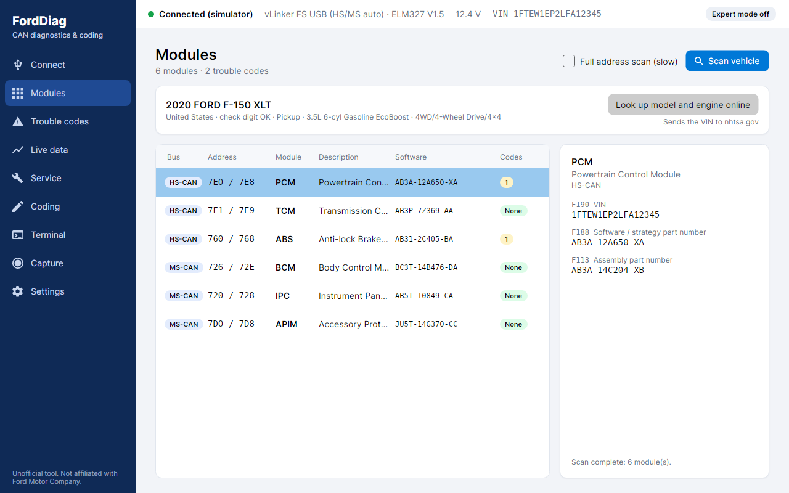

# FordDiag

Ford CAN diagnostics and guarded coding, inspired by FORScan. Cross-platform GUI (Windows, macOS, Linux; Avalonia 12 / .NET 9) plus a CLI.
Works with ELM327-family USB adapters: **vLinker FS**, **OBDLink EX**, and ELM327 with an HS/MS switch.
Self-contained: the ELM327/STN transport, ISO-TP and the vehicle simulator live in `src/FordDiag.Comms`. Third-party data is listed in `NOTICE.md`.



## Run
```
export PATH=$HOME/.dotnet:$PATH            # if dotnet lives there
dotnet run --project src/FordDiag.App      # GUI; tick "Use built-in vehicle simulator" to try it without a car
dotnet run --project src/FordDiag.Cli -- scan --sim
dotnet test
scripts/publish.sh                         # zips for win-x64, linux-x64, osx-arm64, osx-x64 in artifacts/
src/FordDiag.App/bin/Debug/net9.0/FordDiag --screenshots docs/screenshots   # headless screenshots, no display needed
```
Windows needs the FTDI VCP driver for the vLinker FS / OBDLink EX; on Linux add your user to the `dialout` group.

## GUI pages
Connect (adapter, port, simulator, battery voltage) · Modules (HS/MS-CAN scan, VIN, part numbers, code counts, vehicle identification) · Trouble codes (read, clear) · Live data (standard mode 01, and **Ford module data**: 4,800+ mode 22 values from any module, matched to your model) · Service (service functions and output tests) · Coding (named-option editor with search, as-built file open/save/compare with checksums, raw DID access, backups) · Terminal (AT/ST and hex UDS) · Settings.

## Coding
Select a module, press **Read from module** (or open an `.txt/.abt/.ab/.xml` file) and change options by name. The editor shows only what changed; **Write changes** (expert mode) re-reads the module, lists the real differences, asks for confirmation, then writes only the changed blocks with a backup and read-back check. Line checksums are recalculated automatically on save (`fordiag asbuilt check|fix|decode` does the same from the command line). Option names (4,800+ options for 55 module families) come from the [CyanLabs As-Built Database](https://cyanlabs.net/asbuilt-db/) and [consp/apim-asbuilt-decode](https://github.com/consp/apim-asbuilt-decode); the best match for the module's block sizes and part number is preselected and you can switch definition. Modules without a match show raw bytes.

## Vehicle identification, module data, service functions
- **Vehicle:** the VIN read from the car is decoded offline (manufacturer, country, model year, check digit). One click asks NHTSA's free vPIC service for model, trim and engine (the VIN is sent to nhtsa.gov only then).
- **Ford module data:** pick a model (preselected from the lookup) and a module, tick up to 24 values and watch them stream. Definitions come from the [OBDb](https://github.com/OBDb) project (CC-BY-SA-4.0); values OBDb marks experimental are hidden unless you ask.
- **Service:** guided procedures with conditions, warnings, the exact bytes they send, and a dry-run preview. Run needs expert mode and confirmation, checks battery voltage, and always runs its cleanup (for example handing an output back to the module) even if a step fails or you press Stop. Bundled: battery monitoring (BMS) reset (community-reported, not verified), module restarts (ISO 14229), and a mode 08 support probe. **No Ford-specific actuator tests (cooling fan, injectors, ...) are bundled**: those identifiers are not published in any open source I could find. The engine runs any you add (see `docs/FILE_FORMATS.md`).

## Capture: learning from your own FORScan (or any ELM program)
**Capture** records the conversation between another program and your adapter, decodes it into UDS requests (service, routine, output-control and data-identifier requests, with module addresses and plain-language descriptions), and drafts files for FordDiag from it:
1. Disconnect FordDiag, start recording, and in FORScan choose Settings → Connection → WiFi with address `127.0.0.1` and the port shown (FordDiag holds the real adapter and passes every byte through unchanged).
2. Type a marker ("battery reset") before each action, then do it in FORScan.
3. Turn a marker section into a procedure file (it appears on the Service page), save the data identifiers seen as a PID file, or export the captured as-built blocks. Seeds and keys of security access are recorded but cannot be replayed.
CLI: `fordiag capture --port <adapter> --out run.jsonl` (type markers, Ctrl+C), `fordiag capture decode run.jsonl`, `fordiag capture procedures run.jsonl <dir>`. It also reads plain text traces (`>` command / `<` reply lines). Only observe your own vehicle and your own copy of a program; FordDiag does not read or modify any other program's files.

## Safety model
Expert mode (top right, off at every launch) gates every write: clearing codes, DID writes, non-read UDS services and AT/ST configuration commands in the terminal. Writes also check battery voltage (>= 12 V), back up the old value, ask for confirmation, and verify by reading back.

## Status
v0.1, tested against the simulator only (no real adapter or vehicle yet). See `docs/RESEARCH.md` for what is sourced and what is unverified. Imported definitions of non-APIM modules infer each line's width from the source masks, so their layout can be approximate (the app says so); check names against your vehicle before writing. Add or override definitions with `<config dir>/definitions/*.json`. The block -> DID rule (`DE00 + N - 1`) is documented for the APIM and assumed elsewhere. Not implemented: security access (0x27), module programming/flashing.
Unofficial; not affiliated with Ford Motor Company or FORScan.
